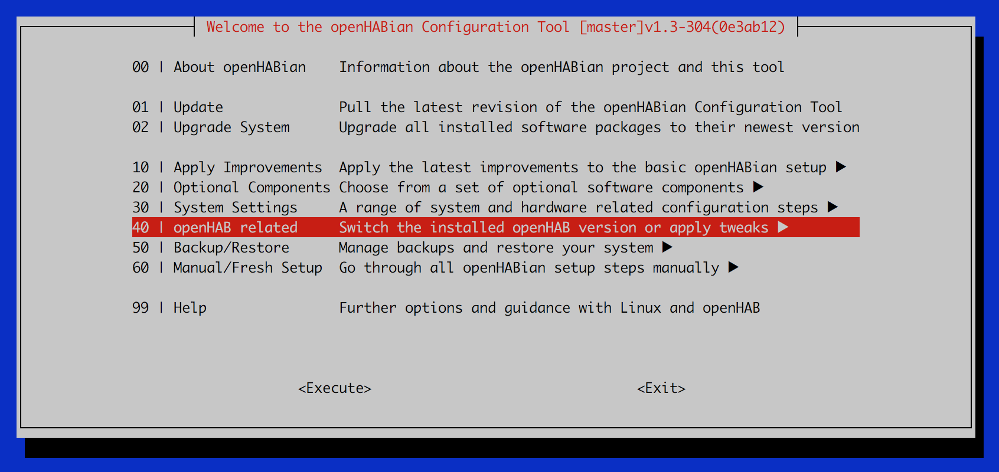
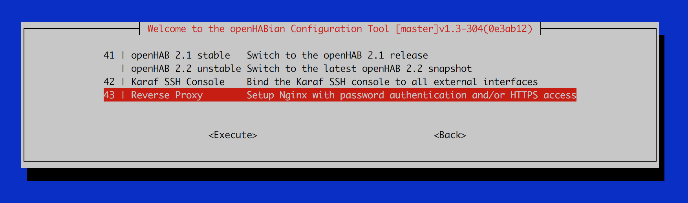

# Raspberry Pi 3
Installation and first steps with Raspbery Pi 3

## Sinks
- [Install heat sinks](https://www.youtube.com/watch?v=e5yMbFIsDSU)

## openhabianpi 
Full documentation and guide to install the operating system in the RP3 is [here](http://docs.openhab.org/installation/openhabian.html#raspberry-pi).

### Summary
- [**Download** the latest “openHABianPi” SD card image file](https://github.com/openhab/openhabian/releases) (Note: the file is xz compressed)
- **Write** the image to your SD card (e.g. with Etcher, able to directly work with xz files)
- **Insert** the SD card into the Raspberry Pi, connect Ethernet (Wi-Fi supported) and power 
- **Wait** approximately 15-45 minutes for openHABian to do its magic

While installing you could connect it via SSH as following (openhabian and password openhabian):
```
ssh openhabian@192.168.0.156
```
When ready: 
- The device will be available under its IP or via the local DNS name **openhabianpi**
- Connect to the openHAB 2 dashboard: **http://openhabianpi:8080**
- Connect to the Samba network shares with username **openhabian** and password **openhabian**
- Connect to the openHAB Log Viewer (frontail): **http://openhabianpi:9001**

### SSL and Basic Auth 
```bash
openhab-config
```



### [myopenhab](https://myopenhab.org)
Other option to manage your openhab remotely. It is integrated with other apps as [IFTTT](https://ifttt.com/?)
    
## Make an image from the SD
[Full guide](https://raspberrypi.stackexchange.com/questions/311/how-do-i-backup-my-raspberry-pi)

To find out the device id of your sd card
```
diskutil list
``` 
To create the image of the device data
```
dd if=</dev/rdiskx> of=</path/to/image> bs=1m
``` 
To restore it into the SD card
```
dd if=</path/to/image> of=</dev/rdiskx>
``` 
To compress it 
```
gzip </path/to/image> > </path/to/image.gz>
``` 
To restore it into the SD card (when compressed)
```
gzip -dc </path/to/image.gz> | dd of=</dev/rdiskx>
``` 

## Raspberry pin up in Python

[Full Example](https://projects.raspberrypi.org/en/projects/python-quick-reaction-game)

Install the library [dependency](https://gpiozero.readthedocs.io/en/stable/installing.html  ):
```bash
sudo apt install python-gpiozero
```
Python Script
```python
from gpiozero import LED, Button
from time import sleep
led = LED(14)
led.on()
sleep(5)
led.off()
```