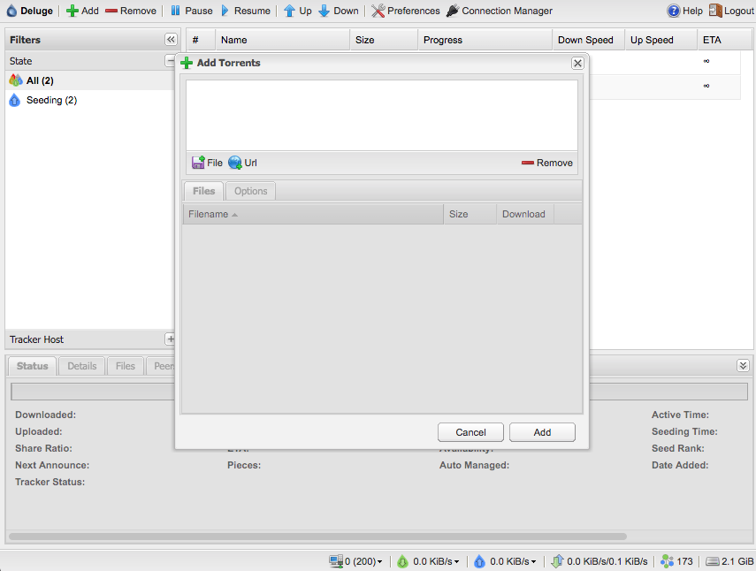

# How to install a Torrent server with WebUI client

Install Deluge and Web client to manage your torrents:

```
sudo apt-get update
sudo apt-get upgrade
sudo apt-get install deluged
sudo apt-get install -y python-mako
sudo apt-get install -y deluge-web
deluge-web
```
You will have your torrent manager at [http://localhost:8112](http://localhost:8112)



Also you can configure it for changing SSL certificate, port, authentication, etc.
```
sudo pkill -9 deluge-web
nano ~/.config/deluge/web.conf
deluge-web
```
And you can launch it on starting your server adding to `crontab`:

```
crontab -e
...
@reboot deluge-web
```
Once you have the torrent server and web UI client, I really recommend [Transdrone][Transdrone] for managing your torrents more friendly.


[Transdrone]:https://play.google.com/store/apps/details?id=org.transdroid.lite